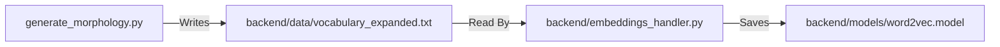

   
   
   
   
   
   
   
   
   # AI Training Map: Word2Vec Model

This explains specifically which files are used to train the "Brain" of your translator.

## 1. Input Data (The "Textbook")
*   **File:** `backend/data/vocabulary_expanded.txt`
*   **Purpose:** Contains 6,000+ lines of Sinhala word variations (e.g., "Potha Pothak", "Balla Ballek").
*   **How it's made:** Run `generate_morphology.py` (in root) to create this.

## 2. Training Script (The "Teacher")
*   **File:** `backend/embeddings_handler.py`
*   **Function:** `train_on_local_data()`
*   **Process:** 
    1.  Reads `vocabulary_expanded.txt`.
    2.  Uses `Gensim` library.
    3.  Runs for **50 Epochs**.

## 3. Output Model (The "Brain")
*   **File:** `backend/models/word2vec.model`
*   **Purpose:** This is the binary file the website loads to understand Sinhala.

---

## 🎯 Summary Flow

